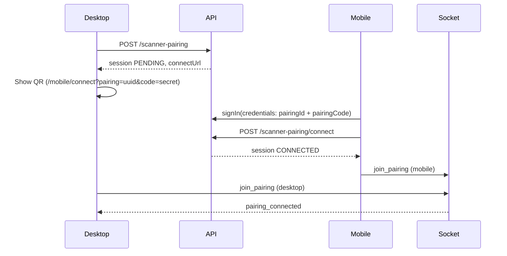

# Mobile Barcode Scanner Pairing

Desktop recording stations pair with a mobile browser scanner over authenticated APIs and Socket.IO. The QR encodes a pairing session id plus a one-time **pairing code** (not the user password). Scanning the QR signs the phone in as the same user who created the session on desktop, then connects the scanner.

## Pairing lifecycle



| Status         | Meaning                                               |
| -------------- | ----------------------------------------------------- |
| `PENDING`      | QR shown; waiting for mobile connect (10 min TTL)     |
| `CONNECTED`    | Mobile linked; heartbeats extend TTL (30 min sliding) |
| `DISCONNECTED` | Operator or socket disconnect                         |
| `EXPIRED`      | TTL elapsed or superseded by a new pairing            |

Rules:

- One active `PENDING`/`CONNECTED` session per user; creating a new session expires the previous.
- Expired sessions cannot reconnect — generate a new QR on desktop.
- Ownership: `userId` on the session must match the authenticated user on both devices.

## Barcode flow

1. Mobile ZXing reader detects a 1D barcode (Code128, Code39, EAN, etc.).
2. Client normalizes via `normalizeBarcodeValue` + `noResiSchema`.
3. Debounce (2s per session) drops duplicate reads.
4. Mobile emits `barcode_scanned` on Socket.IO.
5. Server validates `CONNECTED`, heartbeat freshness, ownership.
6. Server broadcasts `barcode_scanned` and `recording_triggered` to the pairing room.
7. Desktop prefills `noResi`, runs safety checks, shows 3‑2‑1 countdown, calls existing `startRecording()`.

## WebSocket architecture

- Path: `/api/socket` (custom Node server in `apps/web/server.ts`).
- Auth: Auth.js JWT from session cookie on handshake.
- Rooms: `pairing:{sessionId}`.
- Typed events: `apps/web/src/modules/scanner-pairing/socket/events.ts`.
- Handlers: `register-handlers.ts` (no UI or Prisma in components).

### Events (summary)

| Direction | Event                                        | Purpose                            |
| --------- | -------------------------------------------- | ---------------------------------- |
| C→S       | `join_pairing`                               | Join room as `desktop` or `mobile` |
| C→S       | `barcode_scanned`                            | Mobile sends validated barcode     |
| C→S       | `scanner_heartbeat`                          | Keep-alive + DB `lastSeenAt`       |
| C→S       | `disconnect_pairing`                         | Explicit disconnect                |
| S→C       | `barcode_scanned`                            | Broadcast to desktop               |
| S→C       | `barcode_ack`                                | Confirm scan to mobile             |
| S→C       | `pairing_connected` / `pairing_disconnected` | Status sync                        |

## Auto recording lifecycle

After barcode broadcast, desktop `useScannerAutoRecording`:

1. Sets `noResi` in the recording store.
2. Blocks if: recovery modal open, upload in progress, recording busy, tab lock, webcam unavailable.
3. Opens countdown modal (3 seconds); cancel or restart supported.
4. Invokes existing `useRecording` → `startRecording()` (API start, MediaRecorder, tab lock).

Structured logs: `pairing.created`, `pairing.connected`, `pairing.barcode_scanned`, `pairing.auto_recording_triggered`, `pairing.disconnected`, `pairing.sessions_expired`.

## Failure scenarios

| Code                       | Operator message                     |
| -------------------------- | ------------------------------------ |
| `PAIRING_EXPIRED`          | Scan a fresh QR from desktop         |
| `SCANNER_DISCONNECTED`     | Reconnect mobile; check network      |
| `RECORDING_ALREADY_ACTIVE` | Stop current recording first         |
| `WEBCAM_UNAVAILABLE`       | Fix desktop camera before auto-start |
| `RECOVERY_MODAL_ACTIVE`    | Resolve pending recovery uploads     |
| `DUPLICATE_SCAN`           | Wait 2s between identical scans      |

## Reconnect strategy

- **Mobile dropped**: heartbeats stop → stale job marks `DISCONNECTED` → desktop widget updates via socket.
- **Session expired**: no reconnect; desktop creates new pairing (new QR).
- **New pairing while connected**: previous session set to `EXPIRED`.

## Why mobile scanner + desktop station?

| Desktop webcam barcode             | Mobile dedicated scanner                        |
| ---------------------------------- | ----------------------------------------------- |
| Fixed angle, glare on labels       | Operator holds phone at optimal distance        |
| Competes with preview resolution   | Rear camera tuned for 1D logistics codes        |
| Same machine loads camera + encode | Recording station stays on webcam-only workload |
| Poor ergonomics at packing bench   | Portrait phone fits warehouse workflow          |

ZXing on a phone at close range with autofocus is significantly more reliable for Code128/Code39 shipping labels than a distant webcam frame.

## Running locally

```bash
pnpm install
pnpm db:generate
pnpm db:migrate:dev
cd apps/web && pnpm dev   # Uses server.ts (HTTP + Socket.IO)
```

Use `pnpm dev:next` only if you do not need real-time pairing (API still works; sockets will not).

**Mobile on the same Wi‑Fi:** Set `NEXT_PUBLIC_PAIRING_URL=http://192.168.x.x:3000` in `apps/web/.env.local`. QR codes use that URL only. Desktop can use `http://localhost:3000` via `NEXT_PUBLIC_APP_URL`. The dev server prints both URLs on startup.

**Sign-in on the phone:** `localhost` cookies do not apply on `192.168.x.x`. After scanning the QR, sign in on the phone at the LAN URL with the **same account** as the desktop. Login returns you to `/mobile/connect?pairing=…` automatically.

**Mobile reconnect:** If the browser tab closes or the app crashes while you remain signed in, reopening `/mobile/connect` (or the same pairing URL) reconnects automatically when the session is still valid. The pairing id is kept in `sessionStorage` for the tab session.

**Mobile camera:** Phones require **HTTPS** for `getUserMedia` (HTTP on a LAN IP will fail with `mediaDevices` / `getUserMedia` undefined). The dev server enables HTTPS by default (`DEV_HTTPS` is not `false`). Use the `https://192.168.x.x:3000` QR link and tap through the self-signed certificate warning once, then allow camera access.

## Module layout

```
apps/web/src/modules/scanner-pairing/
  config.ts
  errors/
  repositories/pairing.repository.ts
  services/pairing.service.ts
  socket/events.ts, register-handlers.ts, io-server.ts
  hooks/
  components/
  store/
```
